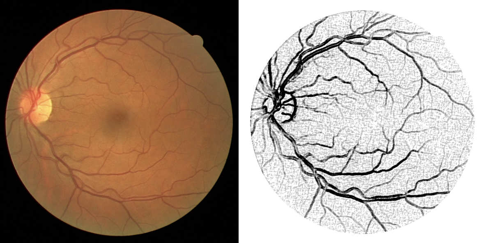

# Detection of retinal dna vessels

The purpose of this application is to automatically detect blood vessels in the bottom of the retina using a given input image. The algorithm employed in this process determines, on a pixel-by-pixel basis, whether a particular pixel represents a blood vessel or not.

To achieve this goal, we have implemented a simplified approach that utilizes the conventional Gaussian image blurring technique with carefully selected parameters. This blurring technique helps in enhancing the image quality for subsequent processing steps.

Building upon the image blurring step, the next stage involves the utilization of the Canny edge detection method. This technique assists in identifying the edges and boundaries of the blood vessels within the retinal image, further contributing to accurate vessel detection.

In the enhanced version of our algorithm, we employ a sophisticated K-Nearest Neighbors (KNN) method, which is trained using small patches (5x5) extracted from the image. By gathering relevant parameters from these patches and subjecting them to the KNN algorithm, we facilitate a comprehensive analysis of the image data.

This advanced approach enables us to effectively learn and classify the pixels within the image, allowing for accurate detection of blood vessels. By leveraging the power of KNN, we can leverage the collected information to make informed decisions regarding the presence or absence of blood vessels in the retinal image.

Through the combination of these techniques, our application provides an automated solution for the detection of retinal DNA vessels, facilitating a comprehensive analysis of the retinal health and aiding in the diagnosis of various ocular conditions.

